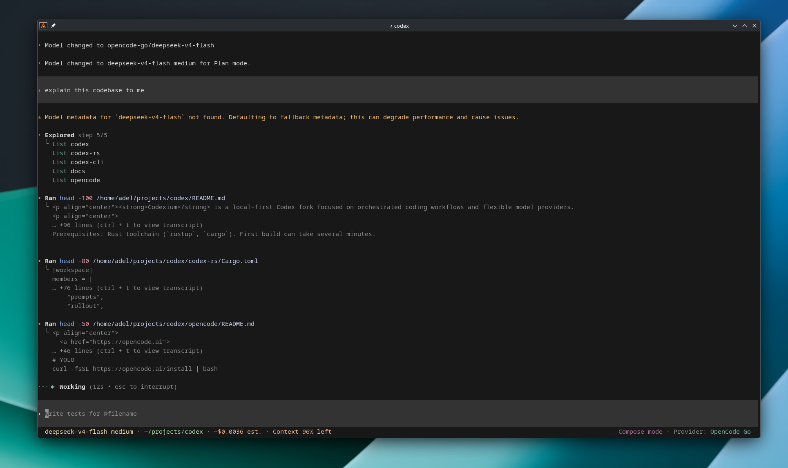

<p align="center"><strong>Codexium</strong> is a local-first Codex fork focused on orchestrated coding workflows and flexible model providers.
<p align="center">
  
</p>
</br>
If you want Codex in your code editor (VS Code, Cursor, Windsurf), <a href="https://developers.openai.com/codex/ide">install in your IDE.</a>
</br>If you want the desktop app experience, run <code>codex app</code> or visit <a href="https://chatgpt.com/codex?app-landing-page=true">the Codex App page</a>.
</br>If you are looking for the <em>cloud-based agent</em> from OpenAI, <strong>Codex Web</strong>, go to <a href="https://chatgpt.com/codex">chatgpt.com/codex</a>.</p>

---

## Quickstart

### Installing and running Codex CLI

Run the following on Mac or Linux to install Codex CLI:

```shell
curl -fsSL https://chatgpt.com/codex/install.sh | sh
```

Run the following on Windows to install Codex CLI:

```
powershell -ExecutionPolicy ByPass -c "irm https://chatgpt.com/codex/install.ps1 | iex"
```

Codex CLI can also be installed via the following package managers:

```shell
# Install using npm
npm install -g @openai/codex
```

```shell
# Install using Homebrew
brew install --cask codex
```

Then simply run `codex` to get started.

<details>
<summary>You can also go to the <a href="https://github.com/playX18/codex/releases/latest">latest GitHub Release</a> and download the appropriate binary for your platform.</summary>

Each GitHub Release contains many executables, but in practice, you likely want one of these:

- macOS
  - Apple Silicon/arm64: `codex-aarch64-apple-darwin.tar.gz`
  - x86_64 (older Mac hardware): `codex-x86_64-apple-darwin.tar.gz`
- Linux
  - x86_64: `codex-x86_64-unknown-linux-musl.tar.gz`
  - arm64: `codex-aarch64-unknown-linux-musl.tar.gz`

Each archive contains a single entry with the platform baked into the name (e.g., `codex-x86_64-unknown-linux-musl`), so you likely want to rename it to `codex` after extracting it.

</details>

### Using Codex with your ChatGPT plan

Run `codex` and select **Sign in with ChatGPT**. We recommend signing into your ChatGPT account to use Codex as part of your Plus, Pro, Business, Edu, or Enterprise plan. [Learn more about what's included in your ChatGPT plan](https://help.openai.com/en/articles/11369540-codex-in-chatgpt).

You can also use Codex with an API key, but this requires [additional setup](https://developers.openai.com/codex/auth#sign-in-with-an-api-key).

## Codexium

**Codexium** is the name for this fork: it keeps the Codex lineage visible while highlighting the main difference from upstream, where the CLI can conduct larger workflows through Compose mode, skills, subagents, structured decisions, and provider-aware model routing.

This repository extends upstream [Codex](https://github.com/openai/codex) with:

- **Compose mode** for orchestrated workflows, ported from [MiMo-Code](https://github.com/XiaomiMiMo/MiMo-Code).
- **Bundled compose skills** that install automatically and guide planning, delegation, review, debugging, verification, and merge workflows.
- **Structured user decisions** through `request_user_input` so complex flows can keep moving without dropping out of the agent loop.
- **Automated subagent model heuristics** with optional `/compose-models` overrides.
- **Native provider catalog support** using [models.dev](https://models.dev), with `codex providers ...`, `/provider`, and per-provider cached model catalogs.
- **A local checkout installer** for building and linking this fork without pretending it is the upstream release installer.

Compose turns Codex into a workflow coordinator: it picks the right skill for each phase, delegates to subagents, and keeps structured user decisions inside the agent loop.

### Quick install

From the repo root:

```shell
# One-shot build + install to ~/.local/bin
./scripts/install/local.sh

# Or via just
just install-local
```

Options:

```shell
./scripts/install/local.sh --profile debug      # faster compile, slower runtime
./scripts/install/local.sh --skip-build         # relink an existing build
CODEX_INSTALL_DIR=~/bin ./scripts/install/local.sh
```

Prerequisites: Rust toolchain (`rustup`, `cargo`). First build can take several minutes.

For upstream-style dependency setup only (no install):

```shell
cd codex-rs && just install
```

### Compose mode

Compose is a third collaboration mode alongside **Default** and **Plan**.

| Mode | Role |
|------|------|
| Default | Direct execution |
| Plan | Read-only reasoning and planning |
| **Compose** | Orchestrated workflows via skills and subagents |

#### How to enter Compose mode

- **Shift+Tab** — cycles Default → Plan → Compose
- **`/compose`** — slash command
- Footer shows a **magenta “Compose mode”** indicator when active

Compose uses your current session model for orchestration. There is no model picker on entry.

#### What Compose does differently

1. **Skill-driven workflows** — 15 bundled `compose:*` skills guide multi-step work; in Compose mode they appear in `<available_skills>` and match automatically from task descriptions.
2. **Hidden outside Compose** — compose skills are excluded from `<available_skills>` in Default/Plan mode; a `<compose_skills>` catalog is also injected in Compose mode.
3. **Subagent dispatch** — the orchestrator may call `spawn_agent` with `task_name` for plan execution, parallel investigation, and two-phase review (spec compliance, then code quality).
4. **Structured user input** — decisions go through `compose:ask` → `request_user_input`, not free-form questions that end the turn.
5. **Automated subagent models** — the orchestrator sets `model` and `reasoning_effort` on each `spawn_agent` call by default; users can optionally override via `/compose-models` or by stating a preference in chat.

#### Subagent model heuristics

Subagent model heuristics are automated by default.

| Subagent role | Model | Reasoning |
|---------------|-------|-----------|
| Architecture, design, broad review | `gpt-5.5` | medium / high / xhigh |
| Integration / judgment implementer | `gpt-5.5` or `gpt-5.4-mini` | medium / high |
| Mechanical implementer (1-2 files, clear spec) | `gpt-5.4-mini` or `gpt-5.5` | low / medium |
| Quick exploration, small fixes, logs, UI tweaks, diff/test loops | `gpt-5.3-codex-spark` | default |
| Reviewer | >= implementer tier | never weaker |

**Spark** is Codex fast mode: near-instant iteration when latency beats depth. Use for small edits, code nav, logs, UI tweaks, simple API propagation, parallel explore-while-planning, and diff/review/test loops. Avoid Spark for architecture, complex refactors, subtle bugs, and review gates.

If Spark is unavailable, use `gpt-5.4-mini` or `gpt-5.5` with low effort for spark-tier work.

**Optional override:** run **`/compose-models`** in Compose mode to set a session default for subagents, or tell the agent your preference in chat. Automated upgrades still apply for reviewers and complex roles. Pick **Automated (default)** in the picker to clear an override.

#### Compose skills

Skills install to `$CODEX_HOME/skills/.compose` on first run. In Compose mode they match automatically from task descriptions, using the same rules as other skills. Invoke explicitly with `$compose:<name>` only if you want to force a specific skill.

| Skill | Purpose |
|-------|---------|
| `compose:brainstorm` | Explore intent and design before implementation |
| `compose:plan` | Write implementation plans |
| `compose:subagent` | Execute plans with per-task subagents + review gates |
| `compose:parallel` | Dispatch independent agents in parallel |
| `compose:review` | Code review before merge |
| `compose:ask` | Structured user decisions via `request_user_input` |
| `compose:tdd` | Test-driven development |
| `compose:debug` | Systematic debugging |
| `compose:execute` | Parallel-session plan execution |
| `compose:worktree` | Isolated git worktrees |
| `compose:merge` | Complete development / merge workflow |
| `compose:verify` | Verification checklist |
| `compose:report` | Status reporting |
| `compose:feedback` | Feedback loops |
| `compose:new-skill` | Author new compose skills |

Skill sources live in `codex-rs/skills/src/assets/compose/`.

### Architecture

| Area | Path |
|------|------|
| Mode enum + TUI visibility | `codex-rs/protocol/src/config_types.rs` |
| Orchestration template | `codex-rs/collaboration-mode-templates/templates/compose.md` |
| Mode preset | `codex-rs/models-manager/src/collaboration_mode_presets.rs` |
| Skill bundle + install | `codex-rs/skills/src/compose.rs` |
| Skill loader (`.compose` root) | `codex-rs/core-skills/src/loader.rs` |
| `<compose_skills>` catalog | `codex-rs/core-skills/src/compose.rs` |
| Context injection | `codex-rs/core/src/context/collaboration_mode_instructions.rs` |
| TUI cycle, slash, footer | `codex-rs/tui/src/collaboration_modes.rs`, `footer.rs`, `slash_dispatch.rs` |

### Typical Compose workflow

1. Enter Compose mode (`/compose` or Shift+Tab).
2. For ambiguous or creative work, invoke `$compose:brainstorm` — present design, get approval.
3. Invoke `$compose:plan` for an implementation plan.
4. Invoke `$compose:subagent` to execute tasks with implementer + reviewer subagents.
5. Use `$compose:ask` whenever a real user decision is needed.
6. Verify and merge via `$compose:verify` / `$compose:merge` as appropriate.

Skip brainstorm when the task is a well-specified bug fix with no design ambiguity.

### Development

```shell
cd codex-rs

# Run from source (no install)
just codex

# Format after changes
just fmt

# Targeted tests
just test -p codex-tui collaboration_mode
just test -p codex-core collaboration_instructions::compose
just test -p codex-core-skills compose
just test -p codex-models-manager compose_mode
```

### Native provider catalog

Third-party providers from [models.dev](https://models.dev) work without cc-switch as an external proxy:

| Command | Purpose |
|---------|---------|
| `codex providers list` | Show active provider and `provider-auth.json` entries |
| `codex providers login [id]` | API-key login; writes `provider-auth.json`, updates `config.toml` |
| `codex providers logout [id]` | Remove third-party credentials |
| `codex providers refresh` | Force-refresh `models-dev.json` cache |

- ChatGPT OAuth stays in `auth.json`; third-party keys live in `provider-auth.json`.
- Generated model catalogs are cached at `$CODEX_HOME/provider-catalog/{id}.json` for instant `/model` picker loads.
- **`/provider`** — switch between ChatGPT and configured third-party providers
- Footer shows **Provider: ...** when a non-OpenAI provider is active

The bridge implementation uses code and design references from [cc-switch](https://github.com/farion1231/cc-switch).

### Differences from upstream Codex

- Adds `ModeKind::Compose` to the protocol and app-server schema.
- Adds Compose to the TUI collaboration-mode cycle and slash commands.
- Bundles and auto-installs 15 compose skills under `$CODEX_HOME/skills/.compose`.
- Injects compose-specific developer instructions and a `<compose_skills>` catalog in Compose mode.
- Relaxes default `spawn_agent` restrictions when Compose skills direct delegation.

### Reference

- [MiMo-Code](https://github.com/XiaomiMiMo/MiMo-Code) Compose inspiration
- [cc-switch](https://github.com/farion1231/cc-switch) bridge implementation reference
- Upstream install docs: `docs/install.md`

## Docs

- [**Codex Documentation**](https://developers.openai.com/codex)
- [**Contributing**](./docs/contributing.md)
- [**Installing & building**](./docs/install.md)
- [**Open source fund**](./docs/open-source-fund.md)

This repository is licensed under the [Apache-2.0 License](LICENSE).
